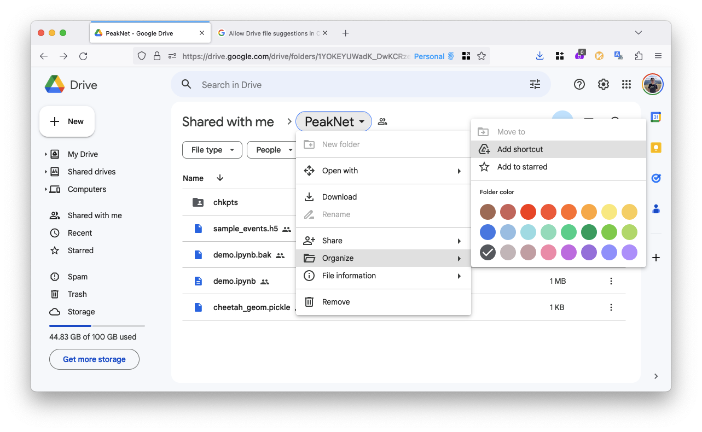
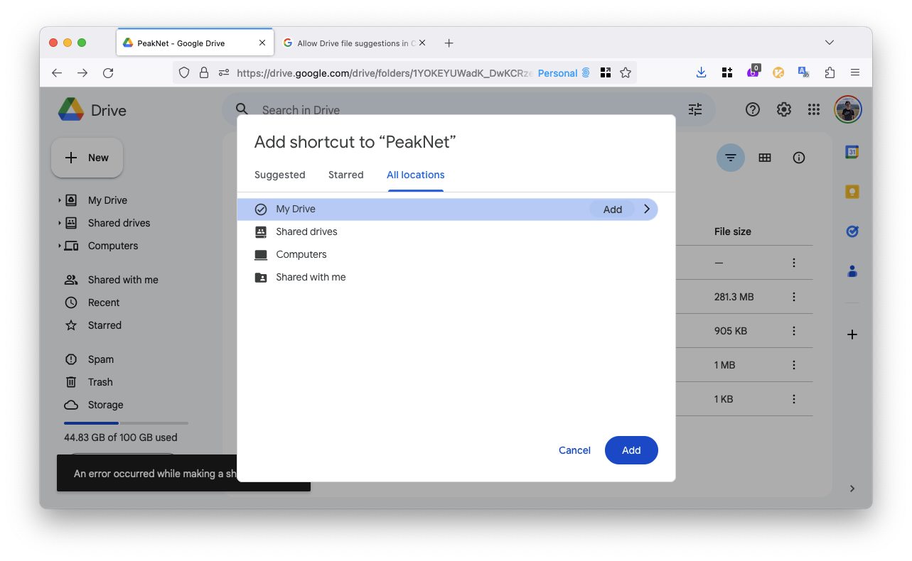
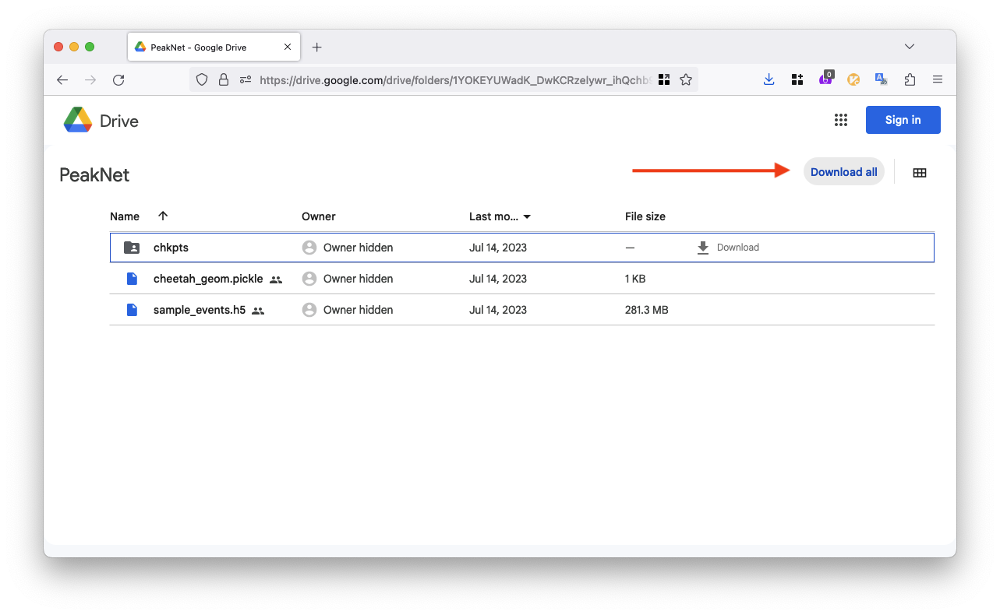
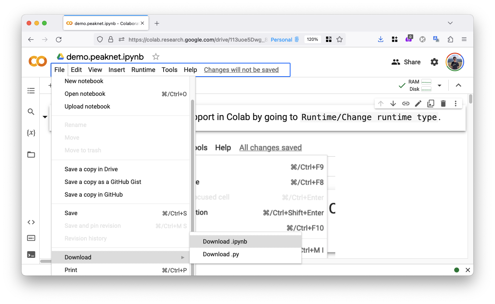
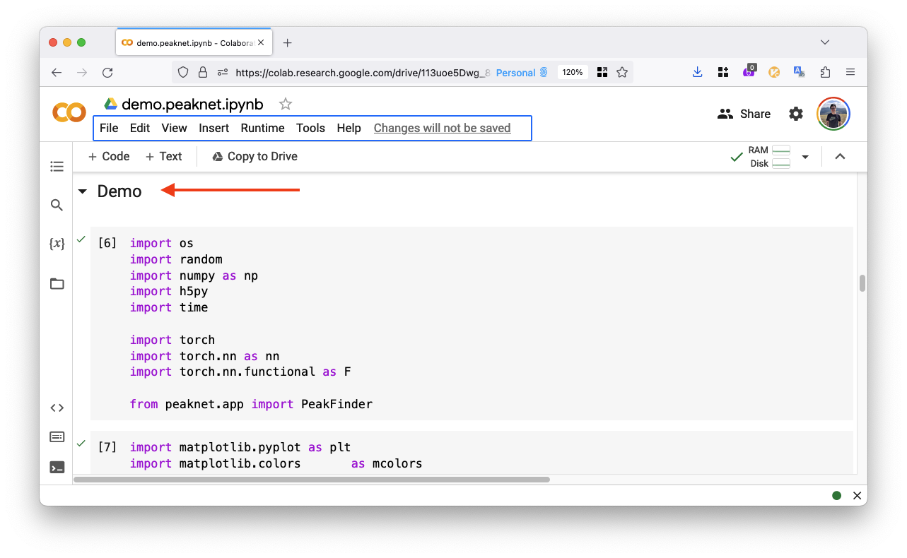

## Try a Colab demo

Add a shortcut to the shared demo data in your own Google Drive:

  - Open the link to access the shared data: [https://drive.google.com/drive/folders/1YOKEYUWadK_DwKCRzelywr_ihQchb9FV?usp=sharing](https://drive.google.com/drive/folders/1YOKEYUWadK_DwKCRzelywr_ihQchb9FV?usp=sharing).

  - Add a shortcut to the shared data in your Google Drive.

    

  - Save it to "My Drive".

    

- Open the Colab link: [https://colab.research.google.com/drive/113uoe5Dwg_8gnNy5NWwWjKCa91qKd-25?usp=sharing](https://colab.research.google.com/drive/113uoe5Dwg_8gnNy5NWwWjKCa91qKd-25?usp=sharing)

- Follow the instructions in the Colab notebook to run the demo.


## Try a demo on your own computers

If you wanted to run `peaknet` on your own computers, please follow the
installtation guide below.

### Installation guide

- Make sure your sytem has `conda` installed, otherwise please refer to the
  [anaconda installation page](https://docs.anaconda.com/free/anaconda/install/) for the installation.

- Create a conda environment for running peaknet.  Let'call this environment
  `peaknet` for now.  Python version greater than 3.6 is required.

    ```
    conda create --name peaknet python=3.9
    ```

- Activate the conda environment.

    ```
    conda activate peaknet
    ```

- Install `pip` for your conda environment `peaknet`.

    ```
    conda install pip
    ```

  Then, you can use `which pip` to check if `pip` is a system-wide command or a
  command pointing to the conda environment.

- Install `torch` and `cupy` that require GPUs.  Our cuda version is `12.0`.

    ```
    # Install torch
    conda install pytorch pytorch-cuda=11.8 -c pytorch -c nvidia

    # Install cupy
    conda install -c conda-forge cupy
    ```

- Install `tqdm`, `scikit-image` and `h5py`.

    ```
    conda install tqdm scikit-image h5py
    ```

- (Demo specific) Install `matplotlib` for visualization using the demo.

    ```
    conda install matplotlib
    ```

- Finally, install `peaknet` directly with a `github` link (it should take less
  than one minute to install).

    ```
    pip install git+https://github.com/carbonscott/peaknet --upgrade
    ```


### Download data and the jupyter notebook

- Download the demo data from the shared folder: [https://drive.google.com/drive/folders/1YOKEYUWadK_DwKCRzelywr_ihQchb9FV?usp=sharing](https://drive.google.com/drive/folders/1YOKEYUWadK_DwKCRzelywr_ihQchb9FV?usp=sharing)

  

- Download the jupyter notebook from the Colab link: 

  

- Copy and paste the downloaded jupyter notebook to the folder containing the
  demo data.

- You can start running the notebook from the `Demo` section.

  
