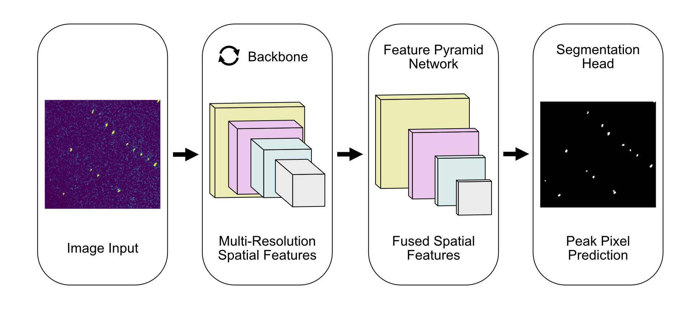

# PeakNet



## Install

### From scratch

- Through `pip`:

```bash
pip install git+https://github.com/carbonscott/peaknet
```

- Install it locally

```bash
git clone git@github.com:carbonscott/peaknet.git

cd peaknet
pip install -e .
```

### Upgrade

```bash
pip install git+https://github.com/carbonscott/peaknet --upgrade
```

```bash
pip uninstall peaknet
pip install git+https://github.com/carbonscott/peaknet
```


## Run a job

- Copy the `train` directory to your project directory.
- Use `launch_job.py` to produce a yaml config and a job script (slurm or bsub).
  For example,

```bash
python \
launch_job.slurm.py \
job=new_job \
sbatch_config.trainer=train.fsdp.py \
train_config.misc.monitors_dynamics=true \
train_config.optim.lr=0.0003 \
train_config.checkpoint.state_dict_type=sharded \
auto_submit=false \
train_config.optim.fused=false \
train_config.misc.compiles_model=false \
train_config.dist.dtype=bfloat16 \
train_config.dataset.batch_size=20 \
train_config.checkpoint.preempt_chkpt_saving_iterations=null \
train_config.checkpoint.chkpt_saving_iterations=10 \
train_config.misc.max_eval_iter=10 \
train_config.lr_scheduler.warmup_iterations=50 \
train_config.lr_scheduler.total_iterations=1000000 \
train_config.dataset.num_workers=2
```

- If you run it interactively, execute the following command on a node with
  gpus.

```bash
mpirun -n 4 python train.fsdp.py experiments/yaml/new_job.yaml
```
